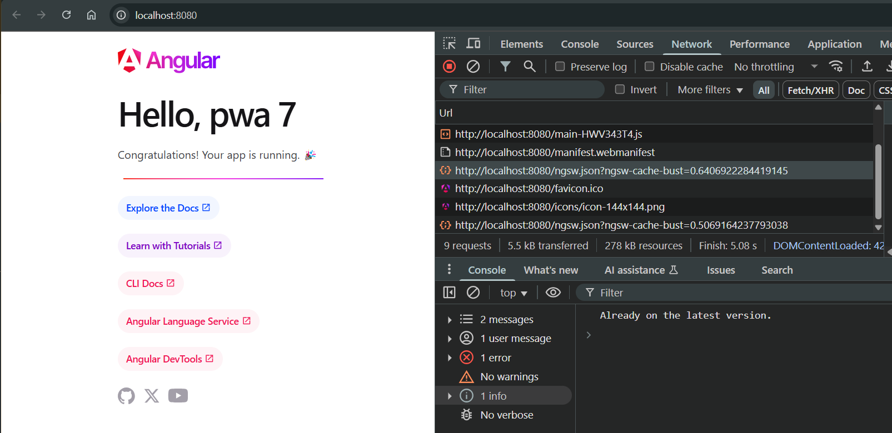

# Angular PWA Update Example

## Overview

This very minimal example shows how to configure Angular PWA to update itself with service workers.

To learn about how to set up a new project as a PWA,
Checkout out, Getting started with service workers,
<https://angular.dev/ecosystem/service-workers/getting-started>

## Get Started with this example

```bash
git clone https://github.com/sravimohan/angular-pwa-update-example.git
cd angular-pwa-update-example
npm install
```

## Run Application

To test the PWA update functionality, build the app in production mode and serve it with an HTTP server.

## Build in production configuration

```bash
ng build --configuration production
```

## Serve using http-server

```bash
npx http-server -p 8080 -c-1 dist/pwa/browser
```

## Test in the Browser

Open your browser and go to http://localhost:8080/, then open DevTools (F12). You should see calls to the /ngsw.json endpoint. In this example, it checks for app updates every six seconds. In your app, adjust the polling interval as needed.



## Check if Your PWA Can Survive Without a Server Running

1. In your terminal, stop the http-server.
2. In the browser, refresh. The app should still work because the PWA caches static assets and can survive a server outage.
3. Keep the browser open for the next steps.

## Update the App

Update the app, for example, by editing the title in src/app/app.component.ts:

```typescript
title = "pwa updated 1";
```

## Build and Run the http-server Again

```bash
ng build --configuration production
npx http-server -p 8080 -c-1 dist/pwa/browser
```

## Verify PWA Updates in the Browser

You should see console logs and a prompt for the new version of the app. Clicking OK reloads the window. You now have the updated version.


## Main Components of the PWA Update Mechanism

### CheckForUpdateService

This service first waits until the app is stable (so Angular bootstrapping is complete), and then it runs an update check periodically. By calling updates.checkForUpdate(), it checks if a new version of the app is available and logs the result to the console. Here you need to decide what is the right polling frequency for your app.

## LogUpdateService (optional)

This service listens to versionUpdates, which emits events whenever a new service worker version is detected, installed, or fails. Each case logs the relevant version hash and update status, allowing you to track the update process in the console.

## PromptUpdateService

This service uses Angular’s service worker update mechanism to check if a new version of the application is available. The constructor injects the SwUpdate service and taps into the versionUpdates observable, which emits notifications about new releases.

Inside this observable pipeline, the code filters events to only respond to those of type VERSION_READY, indicating that a new version is ready to be activated. When such an event appears, the service displays a confirmation dialog to the user. If the user agrees, the page is reloaded, ensuring the application updates to the newest version immediately.

## AppComponent

We activate LogUpdateService, CheckForUpdateService, and PromptUpdateService by injecting them using the inject function. These services allow different update checks and handling operations for the application.

## Further Reading

For more advanced sceanarios checkout Service worker devops, <https://angular.dev/ecosystem/service-workers/devops>
